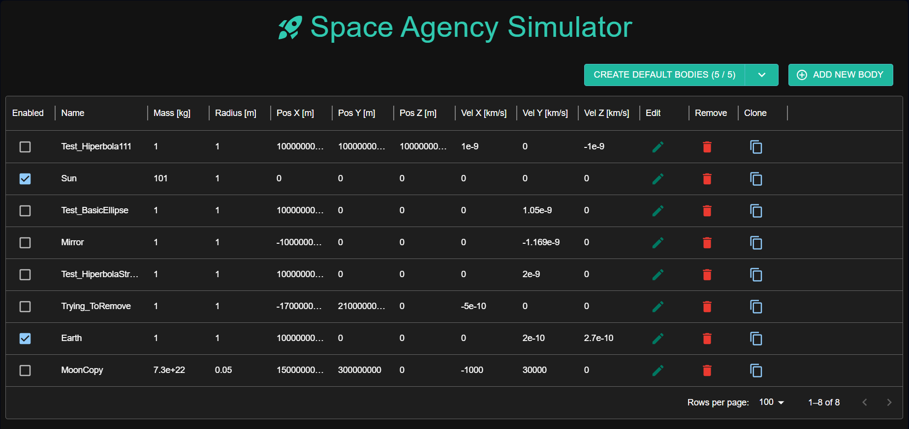
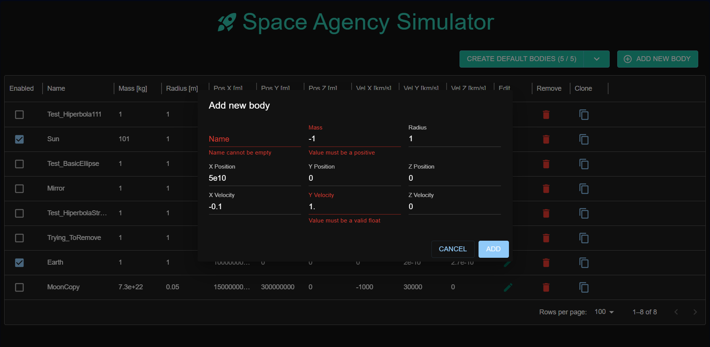
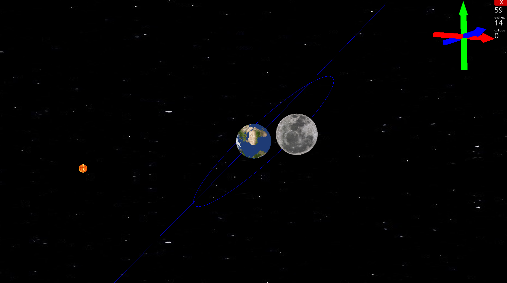
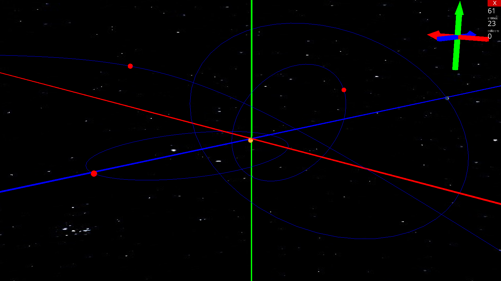

# Space Agency Symulator - Orbit Determination

A multi-component application for simulating and visualizing orbital motion in the classical two-body problem. The system supports both elliptical and hyperbolic trajectories in three-dimensional space and is based on the methods described in *Practical Astrodynamics* by Alessandro De Iaco Veris (2018).

## Overview

The application allows users to create and configure custom star systems, calculate orbital trajectories, and visualize orbital motion in real time.

The project was designed as a complete full-stack solution consisting of:

* ASP.NET Core backend responsible for orbital mechanics calculations and data persistence
* React frontend for system configuration and management
* Python/Ursina visualization client for real-time 3D rendering

## Architecture

### Backend (ASP.NET Core / C#)

The backend acts as the central component of the system.

Responsibilities:

* Orbital mechanics calculations
* State propagation
* Database access
* API endpoints
* Real-time communication with the visualization client

Technologies:

* ASP.NET Core
* Entity Framework Core
* SQL Server
* SignalR
* xUnit

### Frontend (React)

The web application allows users to manage celestial objects and system parameters.

Features:

* Create celestial bodies
* Edit orbital parameters
* Remove objects
* Configure simulation settings

Communication with the backend is performed using Axios and REST APIs.

### Visualization Client (Python + Ursina)

The visualization component renders orbital motion in real time.

Features:

* 3D orbital visualization
* Real-time updates from the simulation server
* Interactive camera controls
* Rendering of elliptical and hyperbolic trajectories

## Mathematics Engine

The project includes a custom mathematical framework called **Mathematica**.

Implemented features:

* Vector operations
* Matrix operations
* Coordinate transformations
* Numerical computations required for orbital mechanics

The framework is covered by automated unit tests using xUnit.

## Data Flow

1. User configures a system through the React application.
2. Configuration is sent to the backend via REST API.
3. Data is stored in SQL Server.
4. The backend performs orbital calculations.
5. Results are streamed to the Python visualization client using SignalR.
6. The visualization client renders the updated orbital trajectories.

## Key Concepts

* Two-body problem
* Keplerian orbits
* Elliptical trajectories
* Hyperbolic trajectories
* Orbital elements
* State vectors
* Coordinate systems
* Numerical methods

## Screenshots

### System Configuration

### 3D Orbit Visualization

## Future Development

Planned features:

* N-body simulations
* Orbital maneuver planning
* Lambert problem solver
* Mission trajectory design
* Additional numerical integration methods

## Motivation

The goal of the project is to combine software engineering with practical astrodynamics by building a complete system capable of configuring, computing, and visualizing orbital trajectories using modern full-stack technologies.
